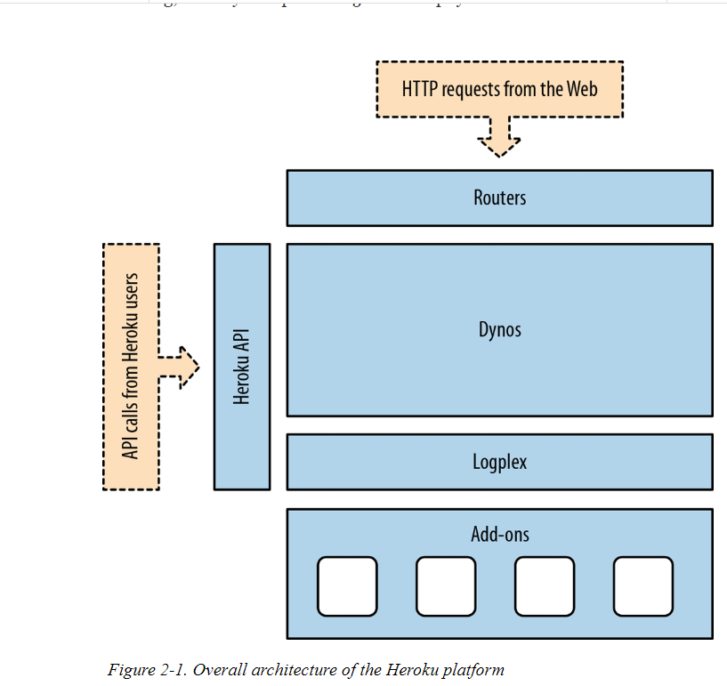
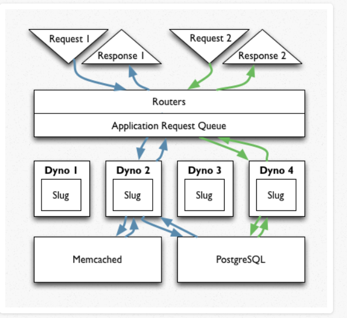
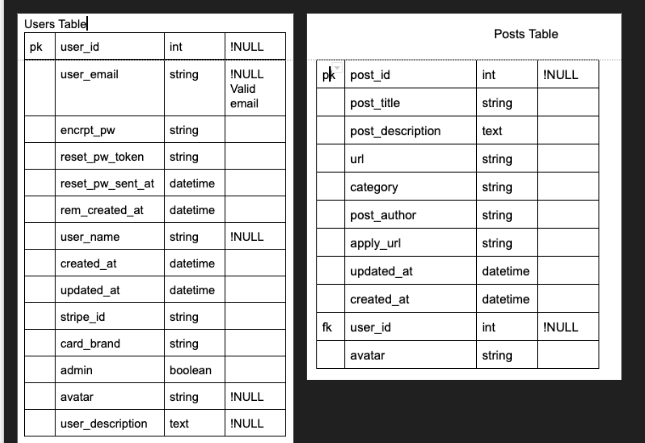

## Link to website
  http://supportr.herokuapp.com/

## Rundown of tech

* Ruby and Rails versions  
  * Ruby 2.6.2
  * Rails 5.2.3

* Gems
  * Devise - User Authentication
  * Carrierwave - Image Upload
  * Mini Magick - Image management and compression
  * Stripe - User payment
  * Simple Form - Form layouts
  * Figaro - App and ENV configuration
  * Better Errors - Improves the default
  * Bulma - CSS framework
  * Rspec-rails - Used for testing

## Setup and run instructions

* Clone the repo into a local directory
* Change into directory

Using bundler, which is available [here](https://bundler.io/), run the command:

```
bundle install
```

Update environment variables in application.yml

Improvements and futures features - beyond MVP:

* Better page linking
* Design is inconsistent - didn't have time to fully style so used Bulma default styles
* Follow users
* Posts can be liked and commented on
* Could improve overall UX
* Mobile design of welcome page
* Better search queries, currently can only search by title
* Handle posts missing images better
* Replace categories with tags. Posts can have many tags, and tags can have many posts.

## Design process

It was intended that the site be clean and modern, in the style of similar websites popular today. Accessibility was a key factor, and colours were chosen based on their contrast scores. Drawing inspiration from sites such as Dribbble, Awwwards and Behance we narrowed down a vision and overall flow.

The designs were completed in Sketch, a popular UI design program.

These are some of the designs, the rest can be viewed [here](https://github.com/RhyG/rails-marketplace/tree/master/docs/designs).


Our end product is fairly close to our initial designs. The main differences are in the posts layouts where time constraints saw us falling back on built in Bulma styles. In the future we would hope to achieve better consistency throughout the sites amongst the styles.

### User Stories

**MVP:** 

1. As a user I should be able to:
2. Log in and log out
3. Create a profile with an image and a description and delete it
4. Post my content, edit and delete it
5. View other users profiles
6. Donate to or receive donations 

**User Personas** 
<br>
*Content creator* - Dana is an illustrator, she posts her digital illustrations and in her description she advises that she that she does these for fun and if people appreciate them she’d be happy with a donation for a cup of coffee <br>
*Podcaster* - Liam interviews his friends in the hospitality industry about their funny stories, he is hoping to raise some money for a new microphone- he advises this in his user profile description. <br>
*Blogger* - Rachel is a blogger- she uses the platform in hopes that her content reaches more people - she’s not in it for the money<br>
*Consumer* - Rhys enjoys a good yarn - he likes the funny stories Liam tells, he swings Liam $5 towards that new Microphone<br> 
*Consumer* - Leo loves shoes and he loves people who love shoes. Leo see’s that an up and coming designer is trying to fund a trip to China to source a more sustainable supply line for her vegan leather sneakers. He donates the cost of her flights. <br>
*Consumer* - Torryn has fondness for classical music and he appreciates the people who post their music online - he finds that donating $5 is just like giving a busker some shrapnel. <br>


## The Problem Identified and the Solution 
*1. What is the need (i.e. challenge) that you will be addressing in your project?*<br>
*2. Identify the problem you’re trying to solve by building this particular marketplace App? Why is it a problem that needs solving?*<br>
*3. Describe the project will you be conducting and how. your App will address the needs.*<br>

We identified the following assumptions about culture at large 

People spend heaps of time online 
People spend lots of money on online shopping 
People who create things as a hobby and participate actively in their online community do so out of their own pocket, 
People who have talent are excluded due to socio-economic factors 
It is difficult for everyday people to meaningfully patronize the arts

In 2019 many people find themselves spending a vast amount of their spare time online. This could be online shopping or is could be curating an instagram feed. Imagine if instead of spending your time consuming things, you spent some time contributing to someone else’s hobby? It can’t be denied the small dose of dopamine that accompanies the purchase of a product is thrilling. We aim to redirect this cheap thrill to supporting a hobbiest and away from a sweatshop in southeast Asia.  

We ambitiously hope that by providing a platform that people can engage with the arts we are bringing together things that the world needs. Patronage of the arts, support to individuals, the ability to participate in culture without the exclusivity of affluence. Currently there are many platforms that put the onus on the creator to provide more content for patrons. This creates an atmosphere of pressure and expectation. 

When we thought on the amount of effort that some content creators go to without recognition or reparation we decided to provide an alternative to exclusive membership where creators have the freedom to work without commercial concerns, hopefully creating things that truly and purely reflect their artistic abilities and skills rather than their ability to tap into pop culture and capitalise on trends to make sales. 

Artists/creators need a way to seek patronage without worrying about creating exclusive content for memberships or exchanging intellectual property. As the artists are not selling anything; copyright and fair use concerns are minimal. Artists can create free from commercial concerns and expectations of their patrons. 


We’re hoping to create a platform where people can have an experience similar to a museum or a gallery. It’s free, there is beauty, it can be meditative and inspirational. Should you be particularly moved by something you can donate to the artist.

Platforms like Patreon and Ko-fi or crowd funding like kickstarter or gofundme address more complex issues like goal orientated capital raising or are based on a membership model (monthly debits) and thus limit access by merit of productivity. Our platform aims to simplify the marketplace as a pure form of patronage. User’s do not have the ability to comment on work but they can “like” it. By removing this functionality common on most platforms we hope to minimise the kind of harm and trauma experienced by many people on platforms where opinions are difficult to moderate. 


Our platform allows users to sign up and post content, they can also accept donations. 
There is an administration function that can delete users and account. The administration can not be a user to protect from conflict of interest. The administration functions to resolve intellectual property disputes. 

Because the platform is not based on the idea of exclusive access or content creators are free to post work that they have made in the past and can easily build a large portfolio. We have deliberately made the platform as bare bones as possible in order to be a figurative blank canvas. 

## Our Software, Database and Third Parties
*5. Identify and describe the software to be used in your App.*<br>
*6. Identify the database to be used in your App and provide a justification for your choice.*<br>
*10. Detail any third party services that your App will use.*<br>


There is an old adage “right tool for the right job”. Keeping this paradigm in mind when considering the appropriate database for our platform meant taking into account what we were familiar with in order to meet the timeline of the assignment and assign tasks in a fair way. The assignments requirements included that the application be deployed on Heroku or AWS and our tech stack includes Ruby on Rails (ruby), SCSS (CSS), HTML and some Javascript for Stripe (payment) integration. Stripe will handle the encryption of customers payment methods and the transaction with the financial institution. 
With the creator of Ruby onboard at Heroku it was clear that Rails novice developers are well looked after in terms of ease of deployment and documentation. In consideration of databases the following from Heroku’s website explains succinctly the choice of PostgreSQL  “At Heroku, we believe PostgreSQL offers the best mix of powerful features, data integrity, speed, standards compliance, and open-source code of an SQL database on the planet”. 
Our familiarity with Ruby Gems like Devise (Full List of Gems) to solve problems and do some grunt work began to make it very obvious that Heroku was the choice for deployment, rather than learning a new platform like AWS. Heroku was developed for continuous deployment and we had experience deploying apps this way. This ultimately meant that only a PostgreSQL database would be appropriate per Heroku’s requirements.


Heroku’s PG requirement means that our User data is most easily represented in a normalised relational database. Our database will be queried based on relations like posts by a user, but it will not be able to query explicitly unrelated data i.e. “users in common”  however a future implementation will allow users to search by “tags” which would potentially relate the explicitly unrelated. Users will still have no direct relation to each other but posts can be related through a “tag” foreign key. Further complexity can be added with a “follow” function and users will be able to see what content other user’s are following. 
PG is ACID and conforms to 160 core conformance of SQL out of 179. It supports materialised views and is extensible as you can create your own data types, operators and index types. There is the support of an open source community committed to making PG the most advanced and secure database in the world. 
However it should be noted that MySQL has better security for web based applications that are consumer and user scalability focused. The apparent simplicity of the relationships in our schema for our MVP make PG an expensive choice in terms of performance however Heroku has a lot of documentation and tools (including log querying, “pg: diagnose”) for the optimization of queries. Another advantage would be that the database requires minimal if any redesigning for extending (scaling) the application.  
To summarize whilst PG may not be the most elegant solution to our database requirements at MVP stage it’s sophistication does allow easy scaling and forces us to be strict early on with our data integrity. It works really well with Rails and Heroku syntax making continuous deployment a little less painstaking. 


## Discussion of Heroku platform and comparison to market
*4. Describe the network infrastructure the App may be based on.* <br>
*11. Describe (in general terms) the data structure of marketplace apps that are similar to your own (e.g. eBay, Airbnb).* <br>

Our app is deployed on Heroku which is a Platform as a Service (PaaS) that sits on top  of AWS. Heroku runs apps in dynos - which are virtual machines. When you need to run more complex tasks you need to add more blocks (which can be done from CLI) this is called scaling horizontally. Alternatively you can make the blocks bigger and this called scaling vertically. 


After normal DNS query procedures have taken place the Heroku router (written in Erlang, called Hermes) matches the URL with your apps dynos and forwards the HTTP request. Hermes looks for an app server (Dyno) with the capacity to handle the request. It will start one if there are none running and will choose at random which dynos it uses. Each app’s dynos are spread across a the “dyno grid” aka heroku’s servers. Heroku runs garbage collection on non-responsive apps to free up capacity. 



When deployed through Heroku git commands the app is compiled into a “slug” and downloaded to a railgun server, mounted and executed in a chroot sandbox. Each dyno has a it’s own isolated Unix container, is completely identical, restarts every 24 hours and can only run one slug. 

Heroku provisions an instance of PostgreSQL (as previously discussed) when your application is created. This database is accessible over TCP/IP, so all dynos can access it simultaneously. 


Essentially all two sided marketplaces are the same. At a very minimum they will have users and posts like our app. Some marketplaces like Gumtree, Airbnb and Facebook Marketplace allow users to be both sellers and buyers. So a user would *have_many* posts and be able to perform all CRUD operations on their own posts.

However some marketplaces like Etsy are more complicated than our’s and may allow sellers to post multiple items for sale and allow users to purchase multiple items. These relationships would mean that a more complex data structure would be required best and normalisation would require a much more thorough approach. 


There may be a products table with each products_id and details of the product like size and colour and a product can *have_many* orders, a product can exist without an order. There would also be a table for customers including all their details, once again a customer can exist without an order, but the order table which would contain keys from the product and customers table can not exist without either of these things and would be a joining table with a primary key of order_id. 


So a customer Model with a foreign key of “user_id” would interact with the product model through the order model. A User Model (table) would need to contain the user’s avatar, password etc - this would be different from their customer table which would be about their shipping address and contact details. 

## Questions relating to Architecture and Design of App 
*8. Describe the architecture of your App.*<br>
*9. Explain the different high-level components (abstractions) in your App.*
<br>

Our app is built using Ruby on Rails (RoR) and follows the Model-View-Controller architecture pattern (MVC). The framework takes away much of handling of technologies and allows the developer to focus on solving the business problem. It does this with the help of convention over configuration and has strict naming conventions for Models-Views-Controllers. RoR also uses Representational State Transfer (REST) for web services which relies on the HTTP protocol for CRUD operations. Supports PostgreSQL and uses YAML. <br>

#### Models 
Models are the representation of the business domain in the Ruby language and are responsible for persistent storage. <br>

Our app includes Application_record, User and Post Models. 
The User and Post models in our app handle the business logic by allowing that 	anyone who makes an account can both post and view content, or receive donations. <br>
These Models also can be seen as abstraction of the database tables. The structure of the database table is represented in the attributes of the class that is each model, and instances of the class represent lines in the database tables. 
<br>
#### Rails Server (localhost - Puma Gem) 
The Ruby on Rails Server, is an executable that instantiates a Web Server. Whilst in development Rails server is listening on local port 3000 so your app can be accessed on the web. <br> 

#### Routes 
<br>
The routes comprise a way to tell which URL paths our application uses. 

#### Controllers and their Actions 
<br>
A controller is a Ruby class with public methods. The incoming request is routed according to routes to a method in the controller. The controller then requests data from the model and instantiates an object to be used by the view. <br> 
application_controller -  responsible for devise security methods<br>
orders_controller - creates and shows Stripe payments<br>
pages_controller - show instances of @posts<br>
posts_controller - handles authentication of users and all CRUD operations <br>
Users_controller - show instances of @user <br>

#### Views
<br> 
Views tell the RoR architecture what HTML to render. Views rely on data that is prepared by the controller. Models should never speak directly to the view. The app/views/layout/application folder will contain the html DOCTYPE!. <br>
Devise - these views are responsible for user registration and how the data is handled. 
Orders - this ERB will handle redirecting the patron to Stripe
Pages - contains static pages for payment failure or success and a welcome page
Posts - All CRUD operations 
Users - show function for users
<br>

#### Assets
JavaScript, CSS and Images are stored here. 

## Agile Methodology and Source Control
<br> 
Our application of the agile methodology is as follows. 
<br>
Our iterative approach was to do small sections of code written together in pairs on the one machine. Thus source control exists only on the one machine. Code is unit tested before being pushed to Rhys’s github to be ultimately deployed on heroku. 
<br>
Agile favours face to face communication and Rhys and I made an effort to attend class everyday and communicated clearly our restraints and commitments outside of the classroom. We were able to agree that most of the work needed to be done in the classroom. 
<br>
Stand-Up (Scrum) <br>
We agreed that with only 2 weeks to get our project across the line a more frequent check in would be required other than the traditional once a morning. <br>
We agreed to check in upon arrival, just before breaking for lunch and again as we were leaving for home. <br>
I recorded the minutes of these meetings to avoid using a trello board as we all did not want to add further work to the process. We discussed the value of Kanban but as we had not worked together before and were not too familiar with the tech stack we decided that having to describe tasks to place on a trello board would hamper our intuitive approach as we were all still learning.  
<br>
In future where abilities and technology are more familiar a wall of post its would have been helpful. We decided that having to check in on something that was another account to log into lead to distraction too easily. 
<br>
Tasks were assigned based on proficiency and inclination. Once our “nice to have’s” were defined we agreed that the assignment could extend into a learning exercise if we had time. 
<br>

<br> Our ACTUAL timeline <br>

**MON** - content taught in class, Dana away, Liam sent through brainstorm. <br>

**TUES** - content taught in class, Liam presents idea further, we agree, roles assigned. <br>

**WED** - Liam rolls a new app and looks into gems/third party to support the functions of his idea, Dana focusing on research aspects, Rhys prototyping HTML.<br>

**THURS** - Liam absent, Dana working on Heroku, Rhys completing HTML<br>

**FRI** - Liam absent, Dana completes SAQ’s 1-7. Rhys rolls new app and works through styling. <br>

**SAT** <br>
**SUN** <br>
**MON - PUBLIC HOL**<br>

**TUES** - Liam absent - pair programming<br>

**WED** - Liam absent - pair programming<br>

**THURS** - Liam absent - Dana finishing Q’s 21-23, Rhys works on testing Gems with Janel<br>

**FRI** - Tidy up readme and Submission<br>

## PostgreSQL 
<br>
*7. Identify and describe the production database setup (i.e. postgres instance).* <br>
*12. Discuss the database relations to be implemented.* <br>
*13. Describe your project’s models in terms of the relationships (active record associations) they have with each other.* <br>
*14. User Schema* <br>

Our database only contains two tables and prioritised simplicity for MVP and because of this there are no many_to_many relationships and thus no joining tables. This structure is normalised, contains no redundancies and it protected from update, deletion and insertion anomalies. As the application scales there should be no unnecessary restructuring of the schema due to new types of data (“tags” function) being introduced.The fields or attributes can be seen in the schema below but it’s important to note that in the database the attributes are actually the columns. For design purposes it is easier to depict the schema this way. It is important the fields or attributes in the entities are not redundant and if possible only appear once this ensures data integrity and helps to query the database more quickly. <br>

Every user of our app is able to post content and accept donations. Some users can be admin. <br>

The users table which contains fields for identification and those created by devise and active records conventional parameters. Some fields are not yet in production like storage of payment option. A user can exist without posts but a user has_many posts. A user can perform all CRUD operations on their own posts. They can only see other users posts. <br>

The posts table which contains fields for describing the type of content, location of the content, activerecord params and belongs_to a user indicated by the user_id foreign key. This is the only association/relationship in our database at the moment. So a user can write posts to the database but post’s can not exist without a user. <br>

In future there will be many_to_many relationships when the “tags” feature is implemented. This will mean that a post can has_many tags and a tag can has_many posts. To keep the database normalised and to prevent redundancy there would need to be a “Tags” entity which would contain a primary “tag_id” and a foreign “post_id” key. <br>




## Tests

Tests were performed using the Rspec gem. A number of tests were written to test that both users and posts can be made, updated and deleted. The results of the tests can be found at [this link](https://github.com/RhyG/rails-marketplace/blob/master/docs/test_result.txt).

The tests implemented were:

  * Posts and users can be made
  * Many (100 in the tests) posts and users can be made
  * Posts and users can be edited
  * Posts and users can be deleted

In the future we would also implement tests to validate flow through the site. These tests would include form and model validation, access throughout the site based on user authentication, different route paths, etc. 